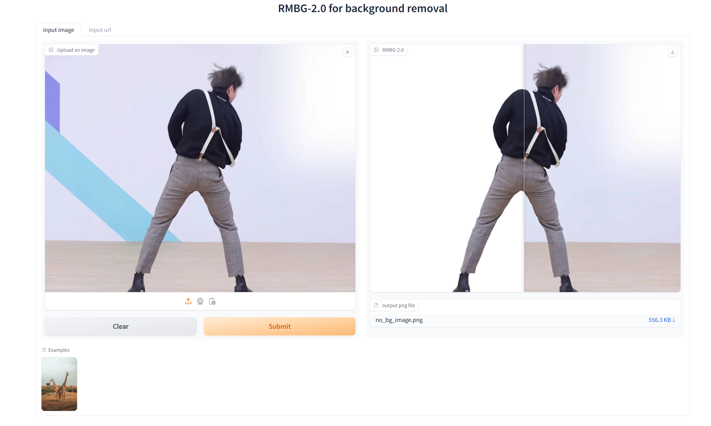

我回来啦！！发现自己好久不发文章了。

在某头部AI公众号实习的过程中，学到太多太多了，也感谢某位大神的指点，也衷心祝愿他的IP可以越做越好

之后因为时间关系，可能要自己出来单干了。

在实习过程中学到的持续了解最新资讯的习惯不能丢掉，所以想维护一个日报，记录自己想去体验的优秀产品或者一些有趣的Idea，会同步到CSDN，知乎，github等一些平台上。

这是因为之后想做一个好的产品，那就需要大量的去学习他人的产品，了解他人的产品

加油！！！

今天

# 1 应用

## 1.1 BRIA RMBG-2.0 开源背景消除（只保留主体）

背景消除这个技术还是蛮多的，IC-light之前也用到了

开源模型Huggingface界面

[briaai/RMBG-2.0 · Hugging Face](https://huggingface.co/briaai/RMBG-2.0)

Gradio使用界面

[BRIA RMBG 2.0 - a Hugging Face Space by briaai](https://huggingface.co/spaces/briaai/BRIA-RMBG-2.0)

# 2 观点

## 2.1 人工智能滥用更容易在哪里发生

Thom_Wolf（Huggingface的联合创始人兼首席科学官）提出一个观点人工智能滥用（深度伪造、假新闻）实际上更容易在闭源模型中发生，而不是在开源模型中。 虽然开源在技术上可能更容易被滥用，但封闭模型的可访问性和以产品为中心的设计可能会带来更多实际危害。

## 2.2 Taste 品味是一项新技能
AI教育家Kris说品味是一项新技能。一定要多看一些伟大的艺术作品。这就是我们人类大脑的训练方式。观察、分析和感知优秀的艺术作品。这样你和AI就会成为超级合作者。让自己置身于令人惊叹的艺术、电影和书籍中，感受它们。
## 2.3 AI时代的软件开发是什么样子的
来源于AI Dance
https://x.com/AI_Whisper_X/status/1856363921902281192
前段时间又一波裁员，AI Dance写了AI时代的一些软件开发和编程现状，评论区比较精彩。总结观点来看。
1. 公司可能会更倾向于将原本的，初始小白员工Junior+有经验的老员工Senior换成Copilot+有经验的老员工Senior
2. 一个老哥开玩笑说程序员自己给自己造棺材哈哈哈，不过AI目前还处于《辅助编程阶段》一个是因为程序开始一个上下游链路较长的生产过程，和文案生成这种简单过程比来说更复杂，另一个原因是程序编码是对最终产物要求非常严格的，不像文案插图生产可以有更多不确定性

