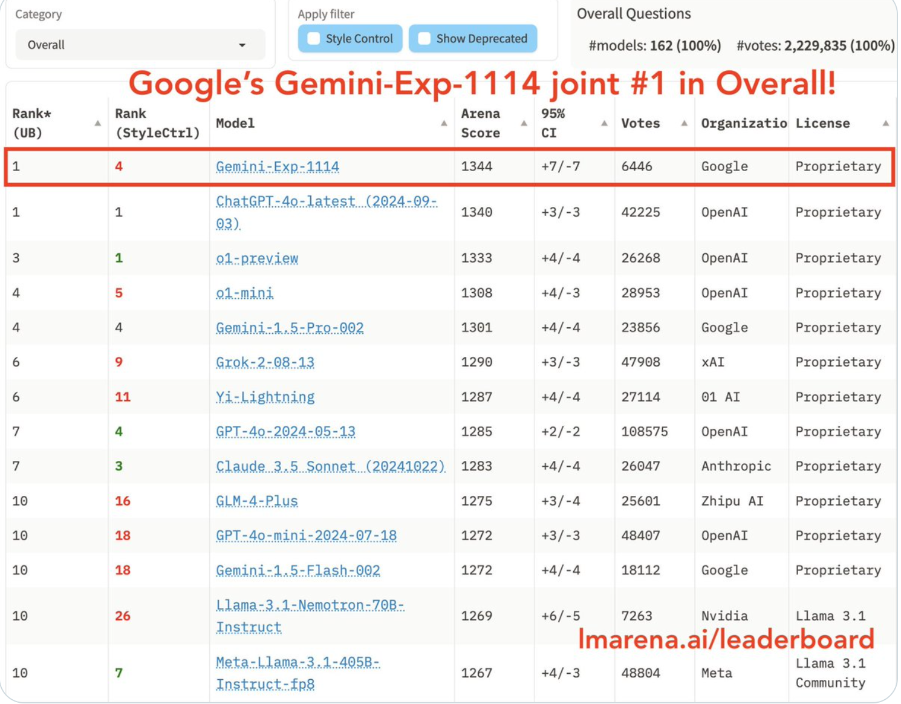
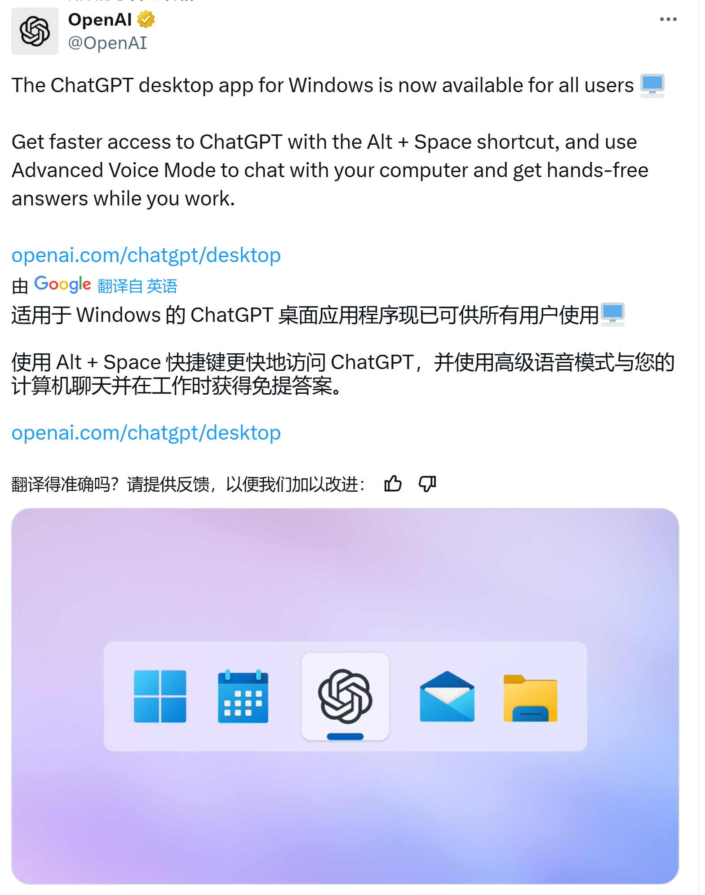
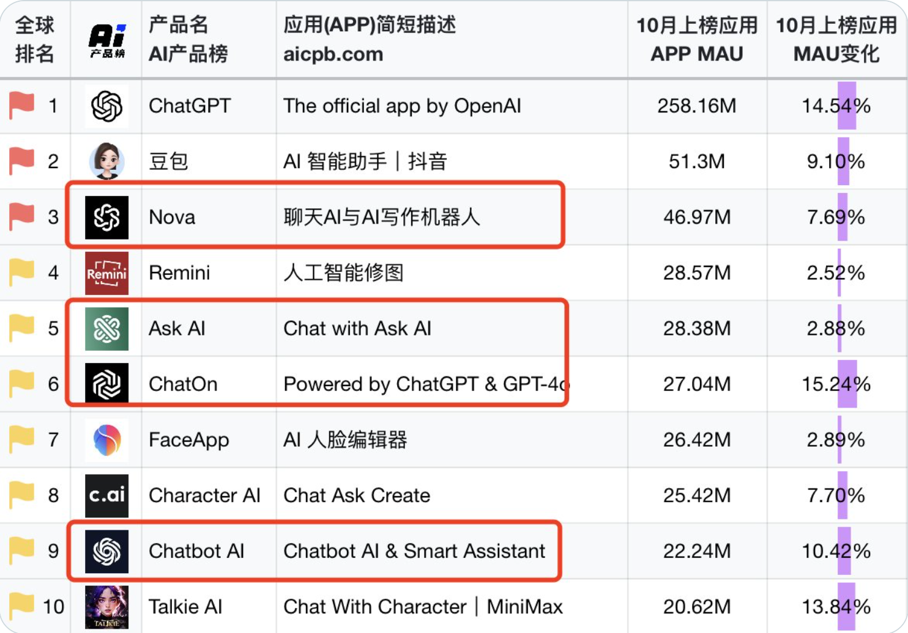

# 目录

## 1.1 AI代码编辑器Windsurf Editor

Windsurf Editor 一个新的 AI IDE 
目前还没有等待列表，没有包月套餐、全免费就可以用 Claude 3.5。
据说可以使用类似的Bolt的方式一句话开始一个项目，可以一键化帮助你安装依赖输入命令启动项目。

## 1.2 谷歌低调放出最新模型，直接干过o1

没有任何发布会，直接干到 LLM 竞技场第一名，超过了 O1-p。
数学、困难提示、创意写作、视觉都排第一
现在 AI Studio 可以直接使用

## 1.3 OpenAI面向windows发布桌面端应用程序

终于可以面向windows端使用chatgpt了！！！

使用 Alt + Space 快捷键更快地访问 ChatGPT，并使用高级语音模式

但是不知道为什么呜呜，我这边 好像下载不了

# 2 观点
## 2.1 AI新榜中，套壳网站赚得盆满钵满
套壳GPT的ChatOn每月赚取500万美元收入，AI产品榜前十，4个是套壳产品。
感觉对于套壳网站来说，其实有些时候是一种“临时赚钱”的方式。所以这也是一个思路，如果你有一个好的产品想法，但是没有好的用户，可以考虑套壳，然后再慢慢迭代自己的产品。

