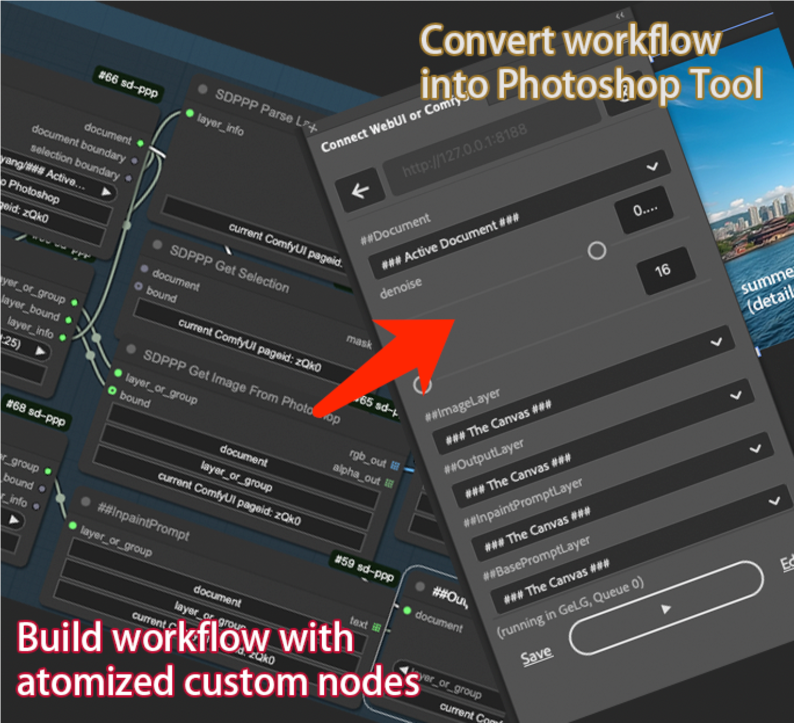

# 1 应用

## 1.1 Mistral AI
Mistral AI推出了新的Le Chat
支持在聊天中进行搜索，上传PDF，编辑，图像生成等
图像生成功能采用了黑森林的Flux1.1 Pro模型
现在感觉上传PDF除了这个Le Chat不怎么限制上下文长度，还有谷歌的Gemini

## 1.2 sd-ppp打通PS和Comfy UI的工作流
https://github.com/zombieyang/sd-ppp

https://github.com/ali-vilab/In-Context-LoRA
In-Context LoRA适用于Flux模型，可以实现AI换衣、logo迁移、商品效果图、四格漫画等各种效果。Github中有各个效果的ComfyUI工作流。

# 2 观点
向Lex Fridman学习每日习惯：高效生活的典范

1️⃣ 清晨信条：

阅读自己的原则，提醒自己避开上瘾性的事物（如社交媒体）。
感恩活着的每一天。
朗读长期（5年）和短期目标。
想象一天的样子。

2️⃣ 4小时深度工作：

先攻克最难任务，全神贯注，无干扰。
其他想法出现时记入Google文档，然后立即回到当前任务。
连上厕所也暂停计时器，绝不偷懒。
关键：专注，时间比结果重要。

3️⃣ 休息一下：

深度工作后，通过音乐（练吉他/弹钢琴）放松大脑、激发灵感。

4️⃣ 运动时间：

每天运动是铁律，即使受伤也锻炼未受伤部位。
健身时听书，身体与思维共同成长。
冷水澡结束锻炼。

5️⃣ 再来4小时深度工作：

深度工作后才吃第一餐（有时一天仅一餐）。

6️⃣ 浅度工作4小时：

第三个四小时，浅度工作。
处理低优先级事务。保持混乱不干扰创造力。
比如回复邮件、编辑视频。

7️⃣ 睡前学习（包含在浅度工作的4小时内）：

一小时阅读论文。（每天阅读一篇论文）
一小时阅读其他书籍，伴随着阅读入眠。
结束一天前，再次复习信条。

注：每天社交媒体使用不超过3次，每次不超过10分钟。